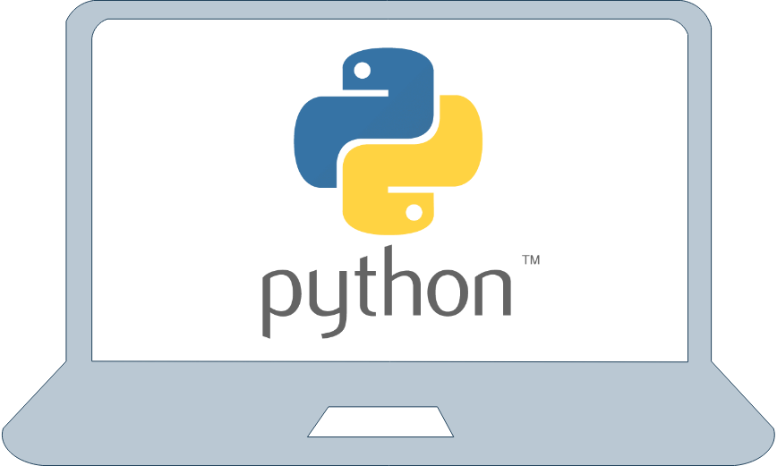
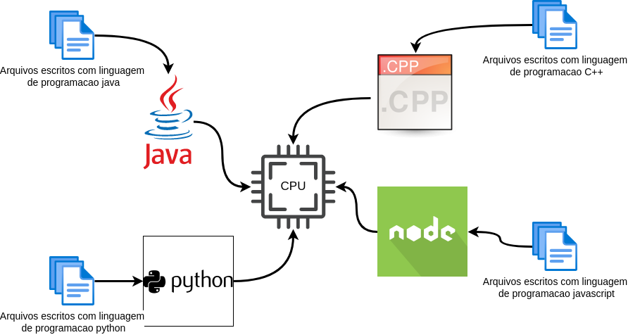

# Introducao a programacao usando linguagem Python

Curso de introducao a programacao e funcionamento de computadores utilizando a linguagem Python [#](https://www.python.org/)

## Agenda de nossas aulas:

- [1o dia](https://github.com/joseteodoro/2023-01-programming-Intro#dia-1o):
    - [#](https://github.com/joseteodoro/2023-01-programming-Intro#introducao-a-computacao) Introdução a computação: funcionamento do computador (CPU, memória e dispositivos de E/S); Pensamento computacional, conceito de programa e algoritmo;
    - [#]() Introdução a linguagem de programação e ao Python; Programação interativa; Comandos de entrada e saída;

- [2o dia](https://github.com/joseteodoro/2023-01-programming-Intro#dia-2o):
    - [#]() Estruturas de controle;
    - [#]() Tipos estruturados sequenciais (String, Listas, Tuplas);

- [3o dia](https://github.com/joseteodoro/2023-01-programming-Intro#dia-3o):
    - [#]() Tipos estruturados não sequenciais (Hashable, Conjuntos e Dicionários);
    - [#]() Funções;

- [4o dia](https://github.com/joseteodoro/2023-01-programming-Intro#dia-4o):
    - [#]() Arquivos;
    - [#]() Python com banco de dados SQLite;


- [5o dia](https://github.com/joseteodoro/2023-01-programming-Intro#dia-5o):
    - [#]() Princípios de Programação Orientada a Objetos em Python;
    - [#]() Visualização de dados em Python;

## Dia 1o

O que vamos ver aqui:

- Introducao a computacao: funcionamento do computador (CPU, memoria e dispositivos de E/S); Pensamento computacional, conceito de programa e algoritmo; Introducao a linguagem de programacao e ao Python;

- Programacao em Python; Comandos de entrada e saída em Python;

### Introducao a computacao

- [o que o profissional de computacao faz?](https://github.com/joseteodoro/2023-01-programming-Intro#o-que-o-professional-de-computacao-ti-faz)
- [quais as partes de um computador?](https://github.com/joseteodoro/2023-01-programming-Intro#quais-as-partes-de-um-computador)
- [sobre o sistema operacional;](https://github.com/joseteodoro/2023-01-programming-Intro#sobre-o-sistema-operacional)
- [sobre modelo, algoritmo e programa;](https://github.com/joseteodoro/2023-01-programming-Intro#sobre-modelo-algoritmo-e-programa)
- [sobre linguagens de programacao;](https://github.com/joseteodoro/2023-01-programming-Intro#sobre-linguagens-de-programacao)
- [como uma linguagem de programacao se torna um programa?](https://github.com/joseteodoro/2023-01-programming-Intro#como-uma-linguagem-de-programacao-se-torna-um-programa)

#### O que o profissional de computacao (TI) faz?

- desenvolvem programas, resolvem problemas, automatizam solucoes, utilizam programas para deixar a vida das pessoas mais facil, utilizam programas para resolver problemas que seria trabalhoso de se resolver manualmente, organizam equipes que estao construindo programas para que elas consigam criar uma solucao grande, elaboram solucoes para que seu site nao leve 10 segundos para abrir?

- podemos ser chamados de desenvolvedor, arquiteto de software, engenheiro de software, programador, lider tecnico, coder, developer, programmer, techlead, software engineer, entre outros nomes;

- de modo simplificado, o profissional de TI resolve problemas utilizando software, as vezes ele escreve, as vezes utiliza ferramentas que outras pessoas escreveram;

- o computador utiliza os programas para executar tarefas. Programas podem ser vistos de modo simplista como sendo passos para dizer ao computador o que fazer. Porem, o computador so faz "estritamemte" aquilo que mandamos fazer. Ele nao pensa por si so, muito menos consegue fazer interpretacoes complexas. As instrucoes precisam ser diretas e nao ambiguas;

Exemplo de ambiguidade:

```
(esposa) - Querido, va ao mercado e me traga 12 ovos, e se tiver leite fresco me traga 2;
```

Nao eh ambiguo para mim, ou para voce, mas o computador nao entende isso ai e possivelmente te traz 2 ovos se ele encontrar leite fresco.

```
(esposa) - Querido, pode comprar sorvete pra gente? Pode ser qualquer sabor desde que nao seja Chocolate;
```

Esse o computador sequer sabe o que fazer, afinal voce nunca disse qual sabor quer e tambem nao disse quais os sabores que sao aceitaveis. Sera que sorvete de xuxu seria aceitavel? Sorvete de beringela? Se voce sabe que sua esposa odeia sorvete de abacaxi, voce considera a possibilidade de levar sorvete de abacaxi, mesmo que ela tenha dito que pode ser de qualquer sabor?

Exemplo de reescrita nao ambigua:

```
(esposa) - Querido, va ao mercado e me traga 12 ovos, e se tiver leite fresco me traga 2 litros de leite fresco e 12 ovos;
```

O computador so entende o que eh preciso, nao ambiguo e direto;

A unica vantagem de um computador para um ser humano eh que a memoria do computador funciona mais rapido, e que o processador consegue fazer calculos mais rapidos.

Por exemplo, um computador com processador de 2,5GHz realiza 2,5 bilhoes de operacoes por segundo. Isso equivale a fazer 2,5 bilhoes de somas ou subtracoes em 1 segundo. Quantas somas voce consegue fazer em 1 segundo?

#### Quais as partes de um computador?

O computador em si eh dividido em varias partes, mas algumas importam mais durante a construcao de um programa e elas estao relacionados ao modo como o computador executa os seus programas. Estas partes relevantes para o desenvolvimento de software sao:

- processador;
- memoria;
- entrada (mouse, teclado, microfone, camera, internet, arquivos, bancos de dados, etc);
- saida (tela, internet, arquivos, bancos de dados, etc).

Como podemos ver na imagem abaixo, tudo gira em torno do processador (CPU), por isso ele eh tao determinante na velocidade de processamento de seu computador e na velocidade com que seus programas rodam. As coisas nao executam na memoria, na internet, na tela, no sistema de arquivos. Eh sempre o processador que executa as operacoes / passos dos programas.


Porque consideramos essas partes mais relevantes durante o desenvolvimento de software? No mundo do desenvolvimento de software dizemos que, cpu e memoria sao rapidos, entrada e saida (IO - input output) sao lentos. Por isso, durante o desenvolvimento de um programa, separamos o que vai em memoria, o que vai de entrada/saida, e o quanto vamos mandar ao mesmo tempo para o processador (veremos mais detalhes sobre isso quando falarmos sobre estruturas de dados).

Como arquivos e internet sao mais lentos que memoria e processador, nos nossos programos utilizamos a memoria para guardar coisas temporarias e salvamos na internet, arquivos, bancos de dados as informacoes que queremos guardar por mais tempo. Lembremos ainda que processador (CPU) e memoria (RAM) sao volateis. Isso significa que eles sao completamente apagados quando voce desliga / reinicia seu computador. Desse modo, toda e qualquer coisa que precisamos guardar para depois precisa ir para algum output (arquivos, internet, bancos de dados).

Quando voce fecha seu navegador, desliga seu computador e depois liga seu computador de novo, o seu navegador abre de novo as abas que estavam abertas? Se sim, pode ter certeza que o programa do navegador criou um arquivo em algum lugar para escrever quais paginas estavam abertas. Quando voce abre o navegador de novo, o programa observa que existe um arquivo salvo com as abas antigas e abre elas novamente. Sua impressao eh de que o navegador continuou de onde parou, mas na verdade ele fechou tudo e abriu tudo de novo antes que voce percebesse. Tudo o que estava em CPU ou memoria foi para o limbo quando o computador desligou / reiniciou.

No computador, tudo que voce observa e menuseia eh software / programa. Seu sistema operacional (Windows, linux, Mac) eh um programa sendo executado em processador e memoria. O mesmo vale para seu navegador, seu office, seu WIFI. Tudo mesmo. E alguem codificou esse programa que voce esta executando. No caso do seu Windows, foram os desenvolvedores da Microsoft que escreveram os programas, do nucleo do sistema (aquilo que possibilita que seu computar execute outros programas) ate os demais programas (Office, navegador, gerenciador de arquivos, player de video, etc).

#### Sobre o sistema operacional

O sistema operacional (S.O.) eh um pedaco de software que possibilita que voce interaja com as pecas do seu computador. Sem ele, seu computador eh um monte de pecas juntas que nao fazem nada. voce pode ate ligar na tomada, mas que so vai ver uma tela preta sem nada escrito. Para que voce consiga utilizar seu computador, o SO eh responsavel por fazer varias coisas:

- organizar como os programas serao executados;
- definir onde comeca um programa e termina outro;
- reservar e proteger trechos da memoria para um programa nao interfira no outro;
- gerenciar disco rigido (HD) e sistemas de arquivos;
- gerenciar conexoes de rede e internet;
- gerenciar como sua tela funciona;
- gerenciar como seu mouse / teclado funcionam;
- entre muitas outras coisas.

Tudo isso (no caso do Windows) foi codificado pelos desenvolvedores da Microsoft para que voce conseguisse utilizar seu computador. E isso nao eh um programa soh! O sistema operacional eh um conjunto de dezenas de milhares de programas que trabalham juntos para que voce consiga fazer suas coisas no dia-a-dia.

Dentro do sistema operacional, existem duas partes que nos atentamos mais de perto. O *escalonador de processos* e os *arquivos executaveis*.

##### Escalonador de processos

Como desenvolvedores, uma parte que precisamos estar atentos no S.O. eh o escalonador de processos. Essa parte do sistema operacional eh responsavel por ficar alternando entre os programas rodando para que todos tenham o seu tempo de execucao, sem que nenhum monopolize todo o tempo do processador.

Pense comigo, durante decadas o computador teve apenas um processador. Como eh possivel que voce na epoca do windows XP pudesse ter varias janelas abertas: com MSN, navegador e Office se voce tinha apenas um processador? Como vimos o processador que processa tudo, e eh o escalonador de processos que fica alternando entre os programas em execucao de tal modo que parece que voce tem mesmo varios processadores. Na verdade, ele fica trocando o foco do processador para que atenda os programas que voce tem. Seu Android, IOS, Windows, linux, MacOs tambem possuem o escalonador de processos, com essa mesma funcao.

E mesmo com varios processadores, como eh o caso dos computadores modernos, ainda precisamos de escalonadores de processos. Porque temos dezenas de milhares de programas rodando ao mesmo tempo e "apenas" 8 processadores (no caso do i7).

##### Arquivos executaveis

Alguns arquivos sao especiais para o sistema operacional, sao arquivos que ele considera como executaveis. De tal modo que, quando abrir um desses arquivos, o S.O. sabe que ele contem instrucoes para o processador fazer algo. Em contrapartida, quando o S.O. ve um arquivo de texto, por exemplo, ele pede para uma aplicacao (editor de texto) abrir esse arquivo. Quando o arquivo eh executavel, o proprio S.O. que abre ele, colocando ele na lista de coisas que o escalonador de processos precisa fazer.

Porque estamos falando desses arquivos numa introducao a programacao? Porque cada S.O. define como ele gosta que esses arquivos se parecam. Por isso, um executavel que roda no windows vai abrir como um arquivo texto no linux, etc. Segue dai que, para criarmos um programa para o windows precisamos gerar um arquivo especifico para ele. Se queremos o mesmo programa para o linux, precisamos gerar um arquivo especifico do jeito que o linux goste.

Existem kits de desenvolvimento de programas (SDK - software development kits) para cada sistema operacional, de modo que voce escreve seu programa utilizando uma linguagem e esses kits geram os executaveis necessarios para que sejam executados no seu S.O. Essas ferramentas, claro, tambem sao programas que foram codificados por outros desenvolvedores. 

Quando estamos contruindo um programa, criamos um modelo, transformamos esse modelo em algoritmos e o SDK pega esses algoritmos e transforma em um arquivo executavel.

#### Sobre modelo, algoritmo e programa

O modelo eh nossa ideia sobre como as coisas devem funcionar (tambem podemos chamar isso de regra de negocio). Por exemplo, se estamos construindo um programa para calcular imposto de renda, precisamos mapear que existem tabelas de percentuais  que dependem do valor do salario, etc. Esse eh o modelo! Essas regras que precisamos seguir para que calculemos o valor do imposto corretamente.

O algoritmo sao os passos que o processador precisa realizar para calcular nosso imposto corretamente. Por exemplo, primeiro deixe eu escrever todos os valores de salario que recebi no ano, depois deixe eu colocar comprovantes de medicos e outras coisas. Por fim, pege tudo isso e me diga quanto de imposto tenho para receber de volta, ou se terei que pagar algo. Aqui voltamos na nossa conversa sobre dizer as coisas de modo direto e sem ambiguidade.

Podemos considerar o programa como sendo todos os algoritmos que voce coloca ali juntos para que facam o calculo do seu imposto de renda. Esses algoritmos estao escritos em alguma linguagem de programacao que voce direciona para um SDK, que por sua vez, gera os executaveis. Assim, seu computador consegue agora rodar seu programa e facilitar a vida de muitas pessoas que precisam declarar seu imposto de renda. 

#### Sobre linguagens de programacao

As linguagens de programacao estao fortemente ligadas aos seus respectivos SDKs, uma vez que voce precisa dizer para o SDK o que voce quer que o processador faca.

Por exemplo, para que o SDK do Python diga ao processador que voce quer calcular o imposto de renda, voce precisa escrever seus algoritmos de um jeito que o Python goste. Para isso, voce utiliza a linguagem Python na escrita dos seus algoritmos. As linguagens de programacao sao nada mais que o jeito que escrevemos nossos algoritmos para que seu SDK gere os executaveis corretamente.

De mesmo modo, se voce estiver usando o SDK do java voce precisa utilizar a linguagem de programacao Java. O mesmo vale para C++, nodejs, etc.



As linguagens sao elaboradas para voce nao escreva nada ambiguo e que seu programa fique bem organizado. Assim, daqui seis meses quando voce olhar seu codigo fonte, voce ainda entende o que ele faz. Elas tambem te ajudam a criar programas que rodam mais rapido porque otimizam o codigos que voce escreve.

O processador faz questao de linguagens de programacao? Absolutamente nao! Linguagens de programacao sao feitos para humanos! Assim, nos podemos escrever programas de modo mais facil do que escrever arquivos em linguagem de maquina (formato que o processador entende).

#### Como uma linguagem de programacao se torna um programa?

Codigo fonte eh o termo correto para falar sobre esses seus algoritmos escritos numa linguagem de programacao qualquer. Voce escreve seus algoritmos num bocado de arquivos de texto e seu SDK transforma esses arquivos em codigo executavel.

No caso do Python, criamos arquivos com a extensao `.py` e o sistema operacional entende que esses arquivos precisam ser direcionados para o Python para que sejam executados. Por exemplo, criamos nosso arquivo `imposto-de-renda.py` e pedimos para que nosso Windows abra esse arquivo. Na pratica, o windows le esse arquivo de texto e percebe que ele eh da linguagem python, entao pede para o SDK do python transformar esse arquivo em um arquivo que seja executavel. Para o windows no entanto, esse arquivo continua sendo apenas um arquivo de texto. Eh o python que faz ele ser executavel.

Se voce nao possuir o python na sua maquina e tentar abrir um arquivo python, seu sistema operacional vai tentar abrir ele como sendo um arquivo de texto qualquer e nao vai executar absolutamente nada.

Por exemplo, se criamos o arquivo `meu-programa.py` com o seguinte conteudo:

```python
    print('esse eh meu programa lindo!')
```

E abrir num sistema operacional sem o python, ele vai abrir seu editor de texto como se fosse um arquivo normal. No entanto, se voce possuir o python, voce vai ver uma tela preta surgir e o processador escrever a mensagem `esse eh meu programa lindo!` nessa tela preta que aparecer.

### Introducao ao Python

terminal
python version
escrevendo meu primeiro arquivo python
executando meu primeiro arquivo python
imprimindo coisas no console
definindo variaveis
operacoes aritmeticas
tipos primitivos no python

## Dia 2o

- Estruturas de controle;

- Tipos estruturados sequenciais (String, Listas, Tuplas);

## Dia 3o

- Tipos estruturados nao sequenciais (Hashable, Conjuntos e Dicionarios);

- Funcoes;

## Dia 4o

- Arquivos;

- Python com banco de dados SQLite;

## Dia 5o

- Princípios de Programacao Orientada a Objetos em Python;

- Visualizacao de dados em Python;


## Referencias;

- [Python home page](https://www.python.org/)

- [Curso Python 3 by Bernd Klein](https://python-course.eu/python-tutorial/)

- [Zen of Python](https://peps.python.org/pep-0020/)

- Ramalho, Luciano. Fluent python. "O'Reilly Media, Inc.", 2022.

- BANIN, S. L., Python 3 – Conceitos e Aplicações – Uma abordagem didática, 2018.

- PERKOVIC, Ljubomir. Introducao a computacao usando Python um foco no desenvolvimento de aplicacoes. Rio de Janeiro LTC, 2016.

- SUMMERFIELD, Mark. Programação em Python 3. Uma Introdução Completa à Linguagem Python. Alta Books, 2013.

- ALVES, Fábio Junior. Introdução à Linguagem de Programação em Python. Editora Ciência Moderna, 2013.

- MENEZES, Nilo Ney Coutinho. Introdução à Programação com Python. Algoritmos e lógica de programação para iniciantes. Novatec, 2010.

- GUTTAG, John V. Introduction to Computation and Programming Using Python. Cambridge: MIT Press, 2013.

- ZELLE, John. Python Programming: An Introduction to Computer Science. 2a ed. Franlin, Beedle & Associates: 2010.

- SEBESTA, R. B., Conceitos de Linguagens de Programação, Bookman, 2011.
