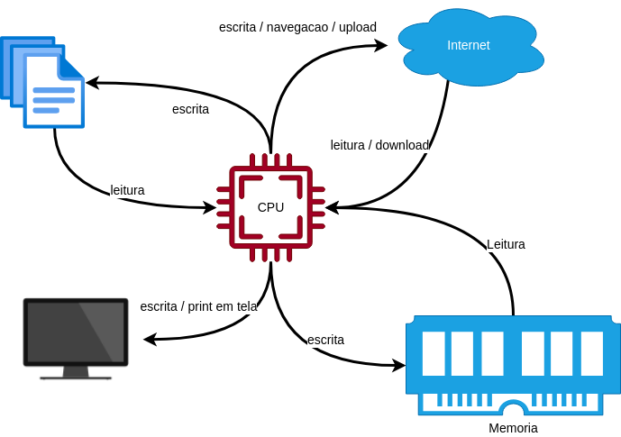

# Introducao a programacao usando linguagem Python

Curso de introducao a programacao e funcionamento de computadores utilizando a linguagem [Python](https://www.python.org/)

## Agenda de nossas aulas:

- [1o dia](https://github.com/joseteodoro/2023-01-programming-Intro#dia-1o):
    - [#](https://github.com/joseteodoro/2023-01-programming-Intro#introducao-a-computacao) Introdução a computação: funcionamento do computador (CPU, memória e dispositivos de E/S); Pensamento computacional, conceito de programa e algoritmo; Introdução a linguagem de programação e ao Python;
    - [#]() Programação interativa em Python; Comandos de entrada e saída em Python;

- [2o dia](https://github.com/joseteodoro/2023-01-programming-Intro#dia-2o):
    - [#]() Estruturas de controle;
    - [#]() Tipos estruturados sequenciais (String, Listas, Tuplas);

- [3o dia](https://github.com/joseteodoro/2023-01-programming-Intro#dia-3o):
    - [#]() Tipos estruturados não sequenciais (Hashable, Conjuntos e Dicionários);
    - [#]() Funções;

- [4o dia](https://github.com/joseteodoro/2023-01-programming-Intro#dia-4o):
    - [#]() Arquivos;
    - [#]() Python com banco de dados SQLite;


- [5o dia](https://github.com/joseteodoro/2023-01-programming-Intro#dia-5o):
    - [#]() Princípios de Programação Orientada a Objetos em Python;
    - [#]() Visualização de dados em Python;

## Dia 1o

O que vamos ver aqui:

- Introducao a computacao: funcionamento do computador (CPU, memoria e dispositivos de E/S); Pensamento computacional, conceito de programa e algoritmo; Introducao a linguagem de programacao e ao Python;

- Programacao em Python; Comandos de entrada e saída em Python;

### Introducao a computacao

- [o que o profissional de computacao faz?](https://github.com/joseteodoro/2023-01-programming-Intro#o-que-o-professional-de-computacao-ti-faz)
- [quais as partes de um computador?](https://github.com/joseteodoro/2023-01-programming-Intro#quais-as-partes-de-um-computador)
- [sobre o sistema operacional;](https://github.com/joseteodoro/2023-01-programming-Intro#sobre-o-sistema-operacional)
- [sobre modelo, algoritmo e programa;](https://github.com/joseteodoro/2023-01-programming-Intro#sobre-modelo-algoritmo-e-programa)
- [sobre linguagens de programacao;](https://github.com/joseteodoro/2023-01-programming-Intro#sobre-linguagens-de-programacao)
- [como uma linguagem de programacao se torna um programa?](https://github.com/joseteodoro/2023-01-programming-Intro#como-uma-linguagem-de-programacao-se-torna-um-programa)

#### O que o professional de computacao (TI) faz?

- desenvolvem programas, resolvem problemas, automatizam solucoes, utilizam programas para deixar a vida das pessoas mais facil, utilizam programas para resolver problemas que seria trabalhoso de se resolver manualmente, organizam equipes que estao construindo programas para que elas consigam criar uma solucao grande, elaboram solucoes para que seu site nao leve 10 segundos para abrir?

- podemos ser chamados de desenvolvedor, arquiteto de software, engenheiro de software, programador, lider tecnico, coder, developer, programmer, techlead, software engineer, entre outros nomes;

- de modo simplificado, o professional de TI resolve problemas utilizando software, as vezes ele escreve, as vezes utiliza ferramentas que outras pessoas escreveram;

- o computador so faz "estritamemte" aquilo que mandamos fazer. Ele nao pensa por si so e na consegue fazer interpretacoes complexas, as instrucoes precisam ser diretas e nao ambiguas;

Exemplo de ambiguidade:

```
(esposa) - Querido, va ao mercado e me traga 12 ovos, e se tiver leite fresco me traga 2;
```

Nao eh ambiguo para mim, ou para voce, mas o computador nao entende isso ai e possivelmente te traz 2 ovos se ele encontrar leite fresco.

```
(esposa) - Querido, pode comprar sorvete pra gente? Pode ser qualquer sabor desde que nao seja Chocolate;
```

Esse o computador sequer sabe o que fazer, afinal voce nunca disse qual sabor quer e tambem nao disse quais os sabores que sao aceitaveis. Sera que sorvete de xuxu seria aceitavel? Sorvete de beringela? Se voce sabe que sua esposa odeia sorvete de abacaxi, voce considera a possibilidade de levar sorvete de abacaxi, mesmo que ela tenha dito que pode ser de qualquer sabor?

Exemplo de reescrita nao ambigua:

```
(esposa) - Querido, va ao mercado e me traga 12 ovos, e se tiver leite fresco me traga 2 litros de leite fresco e 12 ovos;
```

O computador so entende o que eh preciso, nao ambiguo e direto;

A unica vantagem de um computador para um ser humano eh que a memoria do computador funciona mais rapido, e que o processador consegue fazer calculos mais rapidos.

Por exemplo, um computador com processador de 2,5GHz realiza 2,5 bilhoes de operacoes por segundo. Isso equivale a fazer 2,5 bilhoes de somas ou subtracoes em 1 segundo. Quantas somas voce consegue fazer em 1 segundo?

#### Quais as partes de um computador?

O computador em si eh dividido em varias partes, mas umas poucas partes importam durante a construcao de um programa e elas estao relacionados ao modo como o computador executa os programas:

- processador
- memoria
- entrada (mouse, teclado, microfone, camera, internet, arquivos, bancos de dados, etc)
- saida (tela, internet, arquivos, bancos de dados, etc)



Tudo gira em torno do processador (CPU), por isso ele eh tao determinante na velocidade de processamento de seu computador e na velocidade com que seus programas rodam.

Porque consideramos essas partes mais relevantes durante o desenvolvimento de software? No mundo do desenvolvimento de software dizemos que, cpu e memoria sao rapidos, entrada e saida (IO - input output) sao lentos. Por isso, durante o desenvolvimento de um programa, separamos o que vai em memoria, o que vai de entrada/saida, e o quanto vamos mandar ao mesmo tempo para o processador (veremos mais detalhes sobre isso quando falarmos sobre estruturas de dados).

Lembremos ainda que processador (CPU) e memoria (RAM) sao volateis. Isso significa que eles sao completamente apagados quando voce desliga / reinicia seu computador. Desse modo, toda e qualquer coisa que precisamos guardar para depois precisa ir para algum output (arquivos, internet, bancos de dados).

Quando voce fecha seu navegador, desliga seu computador e depois liga seu computador de novo, o seu navegador abre de novo as abas que estavam abertas? Se sim, pode ter certeza que o programa do navegador criou um arquivo em algum lugar para escrever quais paginas estavam abertas. Quando voce abre o navegador de novo, o programa observa que existe um arquivo salvo com as abas antigas e abre elas novamente. Sua impressao eh de que o navegador continuou de onde parou, mas na verdade ele fechou tudo e abriu tudo de novo antes que voce percebesse. Tudo o que estava em CPU ou memoria foi para o limbo quando o computador desligou / reiniciou.

No computador, tudo que voce observa e menuseia eh software / programa. Seu sistema operacional (Windows, linux, Mac) eh um programa sendo executado em processador e memoria. O mesmo vale para seu navegador, seu office, seu WIFI. Tudo mesmo. E alguem codificou esse programa que voce esta executando.

#### Sobre o sistema operacional

#### Sobre modelo, algoritmo e programa

#### Sobre linguagens de programacao

#### Como uma linguagem de programacao se torna um programa?

### Introducao ao Python

## Dia 2o

- Estruturas de controle;

- Tipos estruturados sequenciais (String, Listas, Tuplas);

## Dia 3o

- Tipos estruturados nao sequenciais (Hashable, Conjuntos e Dicionários);

- Fundcões;

## Dia 4o

- Arquivos;

- Python com banco de dados SQLite;

## Dia 5o

- Princípios de Programacao Orientada a Objetos em Python;

- Visualizacao de dados em Python;


## Referencias;

- [Python home page](https://www.python.org/)

- [Curso Python 3 by Bernd Klein](https://python-course.eu/python-tutorial/)

- [Zen of Python](https://peps.python.org/pep-0020/)

- Ramalho, Luciano. Fluent python. "O'Reilly Media, Inc.", 2022.

- BANIN, S. L., Python 3 – Conceitos e Aplicações – Uma abordagem didática, 2018.

- PERKOVIC, Ljubomir. Introducao a computacao usando Python um foco no desenvolvimento de aplicacoes. Rio de Janeiro LTC, 2016.

- SUMMERFIELD, Mark. Programação em Python 3. Uma Introdução Completa à Linguagem Python. Alta Books, 2013.

- ALVES, Fábio Junior. Introdução à Linguagem de Programação em Python. Editora Ciência Moderna, 2013.

- MENEZES, Nilo Ney Coutinho. Introdução à Programação com Python. Algoritmos e lógica de programação para iniciantes. Novatec, 2010.

- GUTTAG, John V. Introduction to Computation and Programming Using Python. Cambridge: MIT Press, 2013.

- ZELLE, John. Python Programming: An Introduction to Computer Science. 2a ed. Franlin, Beedle & Associates: 2010.

- SEBESTA, R. B., Conceitos de Linguagens de Programação, Bookman, 2011.
